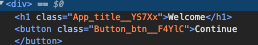

# React 복습

```javascript
function App() {
  const [amount, setAmount] = React.useState(0);
  const [inverted, setInverted] = React.useState(false);

  const change = (e) => {
    setAmount(e.target.value);
  };

  const invert = () => {
    setInverted((current) => !current);
  };

  return <div></div>;
}
```

#### 여러 개 컴포넌트 중 하나를 display

```javascript
function App() {
  const [index, setIndex] = React.useState("0");
  const onSelect = (e) => {
    setIndex(e.target.value);
  };
  return (
    <div>
      <h1>Super Converter</h1>
      <select value={index} onChange={onSelect}>
        <option value="0">Minutes & Hours</option>
        <option value="1">Km & Miles</option>
      </select>
      {index === "0" ? <MinutesToHours /> : null}
      {index === "1" ? <KmToMiles /> : null}
    </div>
  );
}
```

###### 삼항연산자 사용, `{}` 안에서 컴포넌트 선택하기

### props 사용

```javascript
function Btn(props) {
  console.log(props);
  return <button>{props.txt}</button>;
}
```

##### 또는

```javascript
function Btn({ txt }) {
  console.log(props);
  return <button>{txt}</button>;
}
```

### memo

##### props가 변경되지 않은 컴포넌트를 rerendering 할지말지 결정

```javascript
function Btn(props) {
  console.log(props.txt, "Changed");
  return <button onClick={props.onClick}>{props.txt}</button>;
}
const MemorizedBtn = React.memo(Btn);
```

### prop-types 패키지를 통한 타입 지정

```javascript
Btn.propTypes = {
  txt: PropTypes.string,
  fontSize: PropTypes.number,
};
```

##### `isRequired`를 사용해서 필수 prop임을 명시

```javascript
Btn.propTypes = {
  txt: PropTypes.string.isRequired,
  fontSize: PropTypes.number.isRequired,
};
```

### create-react-app

```bash
$npx create-react-app my-app-name
$cd my-app-name
$npm start
```

### Component에 style 적용

##### Button.js

```javascript
import styles from "./Button.module.css";
function Button(prop) {
  return <button className={styles.btn}>{prop.text}</button>;
}
```

```css
.btn {
  color: white;
}
```

##### `className`에 **style.클래스이름** 을 통해 스타일 적용 가능<br>해당 기능을 통해 만들어진 컴포넌트에는 랜덤한 클래스 이름이 부여됨



### useEffect

##### 컴포넌트가 처음 rendering 될 때만 코드를 실행하고 싶을 때<br>ex. API로 데이터 가져올 때

```javascript
import { useEffect, useState } from "react";
function App() {
  console.log("Rendered"); // 렌더링 될 때마다 출력
  const runOnlyOnce = () => {
    console.log("Only once");
  };
  useEffect(runOnlyOnce, []);
  // runOnlyOnce 함수는 렌더링 시 한번만 호출
  return <div></div>;
}
```

##### 특정 state만 변화할 때만 영향을 주고 싶을 때

```javascript
useEffect(() => {
  console.log("keyword state changes");
}, [keyword]);
```

##### 배열 안에 keyword state가 변화할 때마다 코드를 실행하는 코드

##### useEffect Cleanup function

##### 컴포넌트가 생성될 때 useEffect가 실행 => 종료할 때도 실행할 함수 설정

```javascript
function Hello() {
  useEffect(() => {
    console.log("created"); // 컴포넌트 렌더 시 실행
    return () => {
      console.log("destroyed"); // 컴포넌트가 사라질 때 실행
    };
  }, []);
  return <h1>Hello</h1>;
}
```

##### return 값으로 destroy 시 실행할 함수 전달

### 배열 state 에 value 추가

##### `[...array]` 를 사용해서 배열의 값 복사

```javascript
const onSubmit = (e) => {
  e.preventDefault();
  if (toDo === "") {
    return;
  }
  setToDos((currentArray) => [toDo, ...currentArray]);
  setToDo("");
};
```
